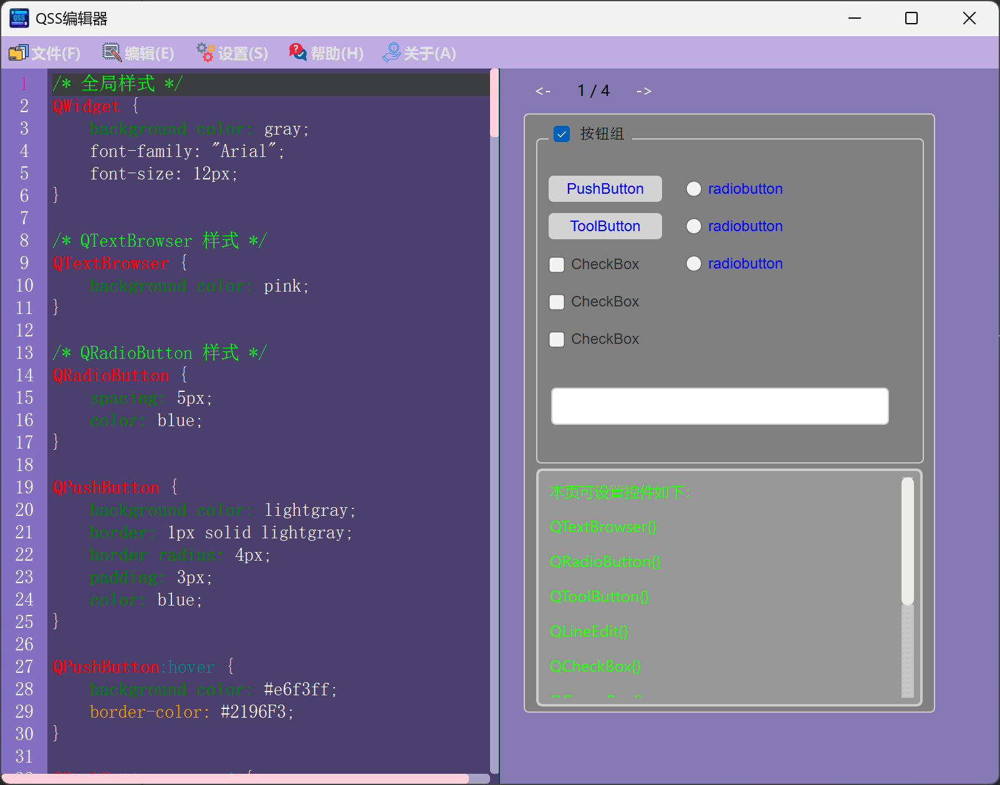
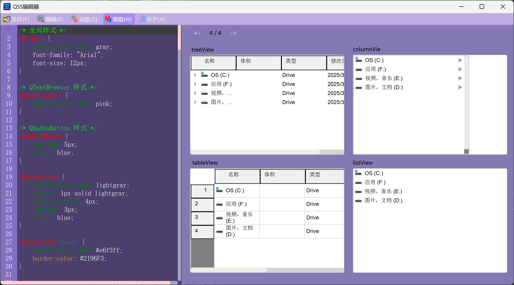
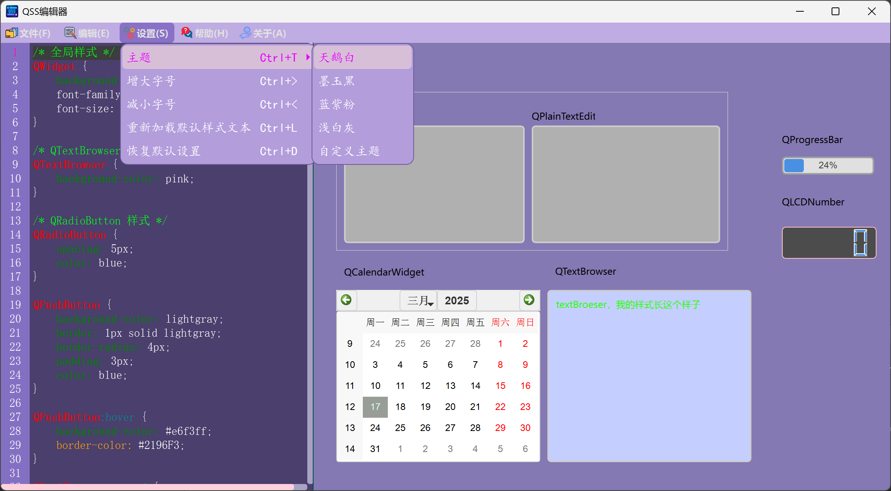
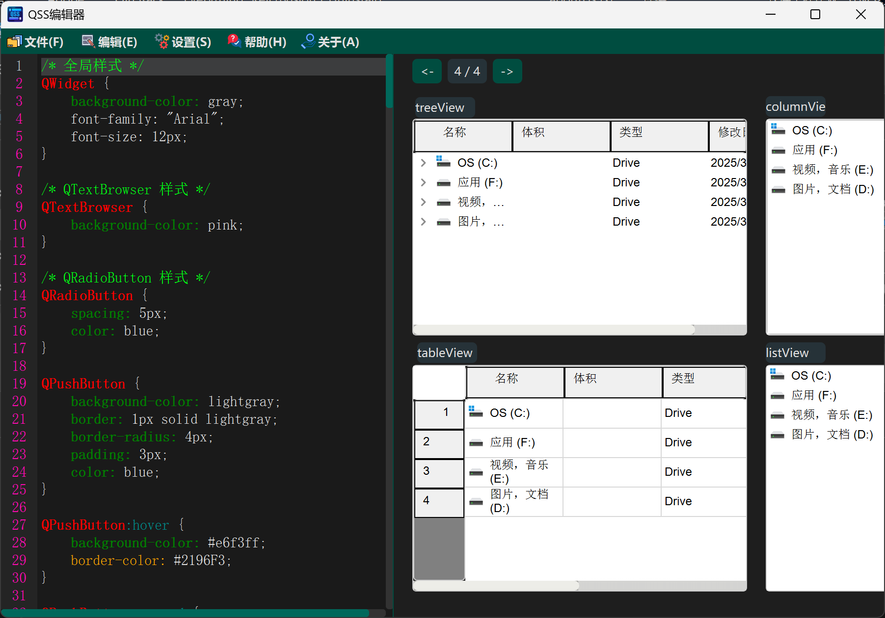
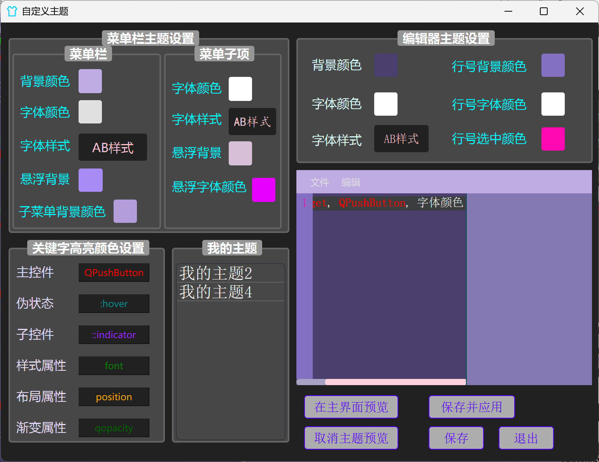
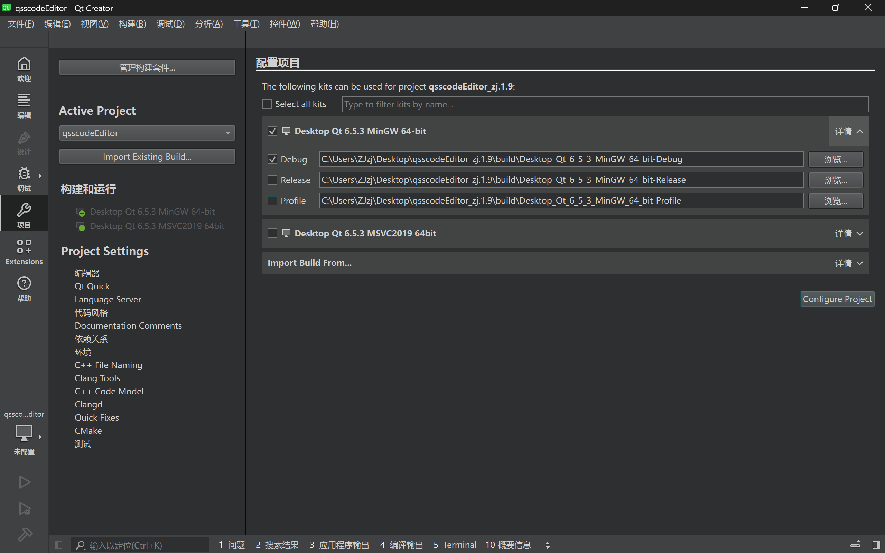

# Qt6 QSS编辑器

## 概览

本项目是一个面向Qt6应用程序的QSS (Qt样式表) 编辑器。它提供了一个用户友好的界面，用于创建和编辑QSS文件，QSS文件可用于自定义Qt应用程序的外观。





## 特点以及功能介绍

- QSS语法高亮
- QSS更改的实时预览
- QSS属性和值的自动补全
- 支持导入与导出QSS文件
- 除了系统预装的主题外，用户可根据需要自定义编辑器主题使用
- 下面切换为墨玉黑的主题预览
  


- 自定义主题


## 源码构建使用

请按照以下步骤构建运行Qt6 QSS编辑器：

1. 克隆仓库：

    ```sh
    git clone https://github.com/zjmllx/qssCodeEditor.git
    ```

2. 打开项目文件夹目录：

    ```sh
    qssCodeEditor
    ```

3. 使用Qt Creator构建项目：
   （1）需要自行下载Qt，版本6.xx以上，该程序基于Qt6.5.3的版本。
   （2）双击项目中的pro文件，点击Configure Project构建项目后运行即可。


## 应用程序使用

1. [下载exe](https://github.com/zjmllx/qssCodeEditor/releases)

2. 打开一个已有的qss或者txt、json、css等文本文件。

3. 使用编辑器修改文件内容，右侧可实时预览修改效果。

4. 导出qss文件。

## 贡献

在此对该项目的贡献者 [fulinlin4980](https://github.com/fulinlin4980) 表示感谢。

## 联系方式

如有任何问题或建议，请在GitHub仓库提交issue，或联系项目负责人：[3674702370@qq.com](mailto:3674702370@qq.com)。
